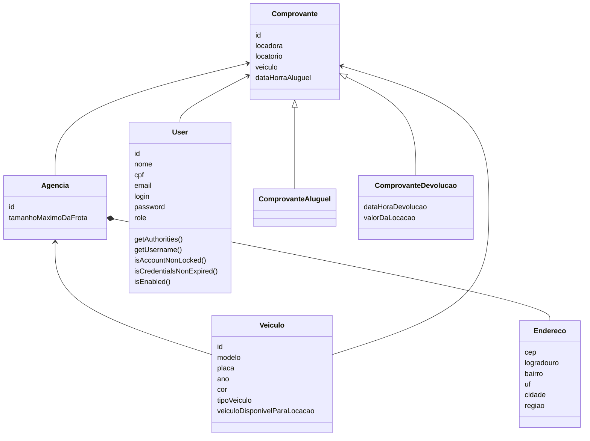

# LOCADORA API

Este é um projeto REST API desenvolvido em Java com Spring Boot que gerencia o aluguel de veículos. A aplicação permite o cadastro, edição, busca e aluguel de veículos, além de possibilitar o registro de agências e clientes. O projeto foi configurado com suporte a banco de dados H2, e é baseado em regras de negócio definidas para uma locadora de veículos.

## Tecnologias Utilizadas
- Java 21
- Spring Boot 3.3.5
- Spring Data JPA para persistência de dados
- H2 Database como banco de dados em memória
- Flyway para versionamento de banco de dados
- MapStruct para mapeamento de objetos
- Lombok para reduzir o código boilerplate
- Springdoc OpenAPI para documentação da API

## Instalação e Configuração

1. Pré-requisitos:
    - Java 21 
    - Maven 3.x
2. Clonar o repositório:
   ````bash
   git clone https://github.com/eyzryder/Sandander-Coders-Locadora.git
   cd Sandander-Coders-Locadora
   ````
3. Configurar o Banco de Dados: O projeto utiliza o banco de dados H2 em memória. Nenhuma configuração adicional é necessária para ambiente de desenvolvimento.
bash
   ````bash
   ./mvn.cmd clean install
   ./mvn.cmd spring-boot:run
   ````
4. Acessar o Banco de Dados H2:

   - URL: http://localhost:8081/h2-console
   - Driver Class: org.h2.Driver 
   - JDBC URL: jdbc:h2:mem:testdb 
   - Usuário: sa 
   - Senha: (em branco)
5. Testar 
   ````bash
   ./mvn.cmd test
   ````
## Documentação da API
A documentação Swagger está disponível em: http://localhost:8081/swagger-ui.html

## Diagrama de Classe

